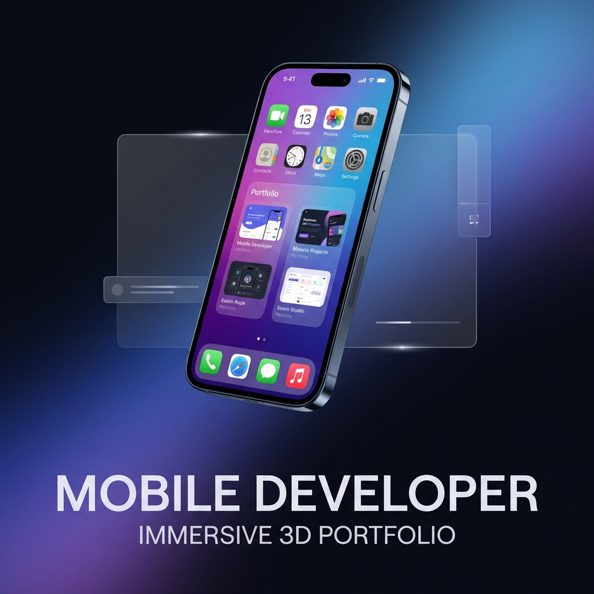

# Paul Leung - Immersive 3D Portfolio



## 🚀 Overview

A professional, high-performance 3D portfolio experience built with **React**, **Three.js**, and **Tailwind CSS**. This project features a unique "Dual-Layer" architecture that blends a procedurally generated 3D hardware environment with a functional 2D software overlay.

Explore my work through a simulated mobile operating system, featuring interactive apps and dynamic 3D device switching.

---

## ✨ Key Features

- **Procedural 3D Hardware**:
  - Dynamic 3D models of iPhone, Google Pixel, and Galaxy Flip 7.
  - Models are generated entirely via code (Three.js ExtrudeGeometry), ensuring mathematical precision and instant load times.
  - Interactive folding mechanics for the Galaxy Flip model.
- **Simulated HomeOS**:
  - A fully functional "OS" simulator inside the 3D phone screen.
  - Interactive apps: Spotify, Photos, Settings, and more.
  - Real-time language switching and Dark/Light mode support.
- **Dual-Layer Architecture**:
  - **Layer 1 (Background)**: A WebGL canvas rendering the 3D world with physical lighting and shadows.
  - **Layer 2 (Foreground)**: A glassmorphic HTML/CSS overlay for traditional portfolio sections (About, Experience, Blog).
- **Smooth Animations**: High-fidelity transitions powered by **Framer Motion** and **React Spring**.
- **Responsive Design**: Elegant viewing experience across mobile, tablet, and desktop devices.

---

## 🛠️ Technology Stack

| Category | Technologies |
| :--- | :--- |
| **Core** | React 19, Vite 7, JavaScript (ES6+) |
| **3D / Graphics** | Three.js, React Three Fiber, React Three Drei |
| **Styling** | Tailwind CSS 4, PostCSS |
| **Animations** | Framer Motion, React Spring |
| **Icons** | Lucide React |

---

## 📁 Project Structure

```bash
src/
├── components/
│   ├── canvas/       # 3D Objects: PhoneModel, Lighting, etc.
│   └── ui/           # 2D Overlay: HomeOS, Header, Experience Sections.
├── assets/           # Static images and resources.
├── main.jsx          # App entry point.
└── App.jsx           # Layout and State orchestration.
```

---

## ⚙️ Getting Started

1.  **Clone the repository**:
    ```bash
    git clone https://github.com/PaulLeung93/portfolio-site.git
    cd portfolio-site
    ```

2.  **Install dependencies**:
    ```bash
    npm install
    ```

3.  **Run the development server**:
    ```bash
    npm run dev
    ```

4.  **Build for production**:
    ```bash
    npm run build
    ```

---

## ✉️ Contact

- **Email**: [PaulLeung93@gmail.com](mailto:PaulLeung93@gmail.com)
- **LinkedIn**: [Paul Leung](https://www.linkedin.com/in/paulleung1993/)
- **Portfolio**: [Live Demo](https://paulleung93.github.io/portfolio-site/)

---

## 📄 License

This project is licensed under the MIT License - see the [LICENSE](LICENSE) file for details.
